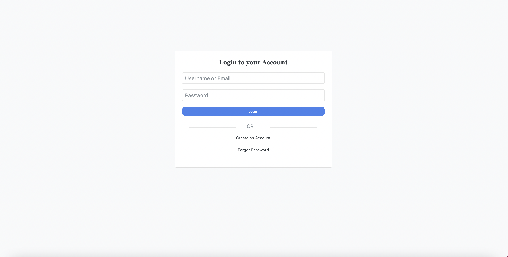
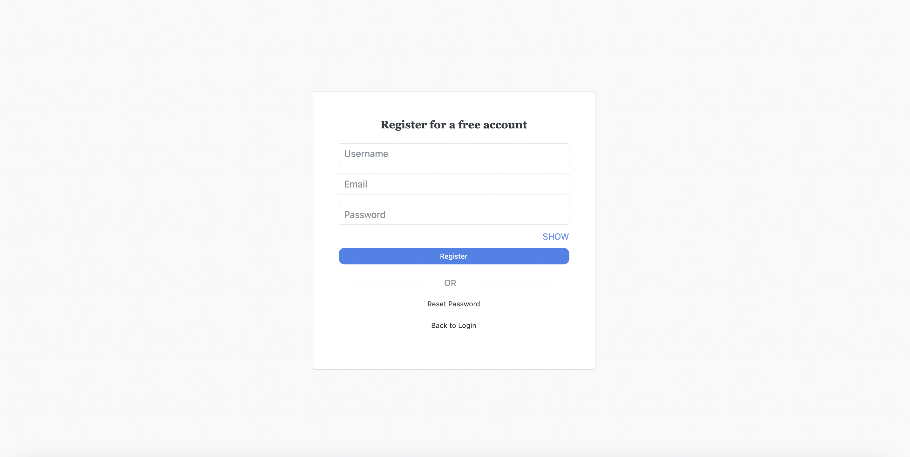
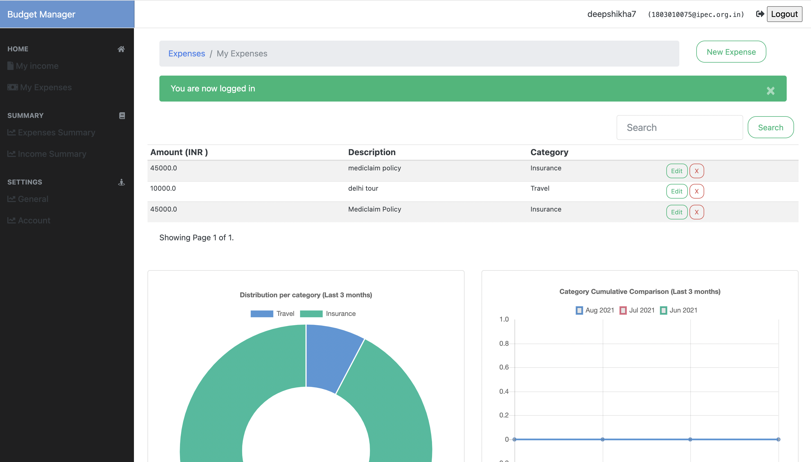
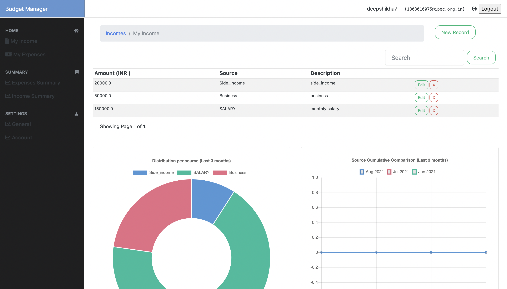
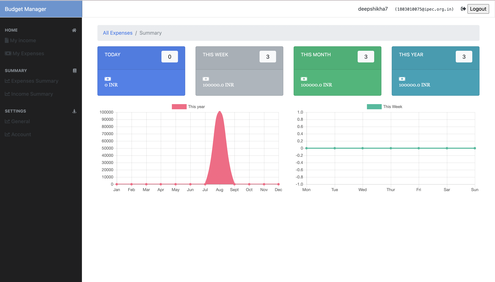

## Budget Manager
While filling the signup form a person will need to fill in the details about the income and the amount he/she wants to save. Details of expenses will be shown in the form of a various chart on a weekly, monthly, and yearly basis.

## How to use this
First make sure PostgreSQL and pgadmin is install in your system. then you have to manually create a DB instance on PostgreSQL named "incomeexpensesdb", better use PgAdmin for that. make a new environment(recommended) and run...

Run pip install -r requirements.txt to install dependencies 
Run python manage.py makemigrations 
Run python manage.py migrate 
Run python manage.py runserver 
Navigate to http://127.0.0.1:8000/ in your browser 

## Link to "Budget Manager" application:
https://budget-tracker007.herokuapp.com

## Some Sceenshots of This Webapp -

